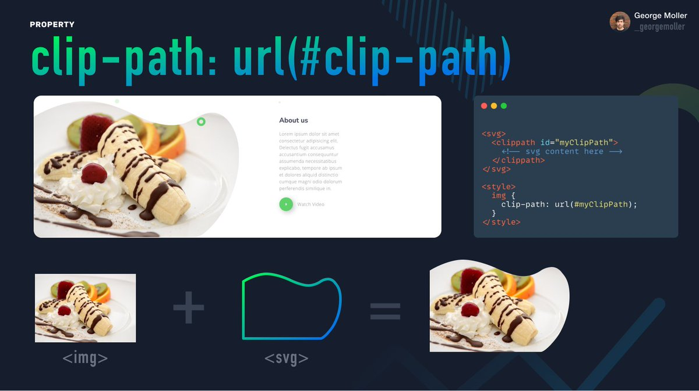

# Image in a Clip-path 🥇 ✍️
``` by George Moller _georgemoller```

### CSS property
`clip-path : url(#clip-path)`

####  This involves the following

```
  +  <svg> = image-in-the-svg-path

```

#### Example of its usage is down below 🥇



#### My done example is down below :smile:


